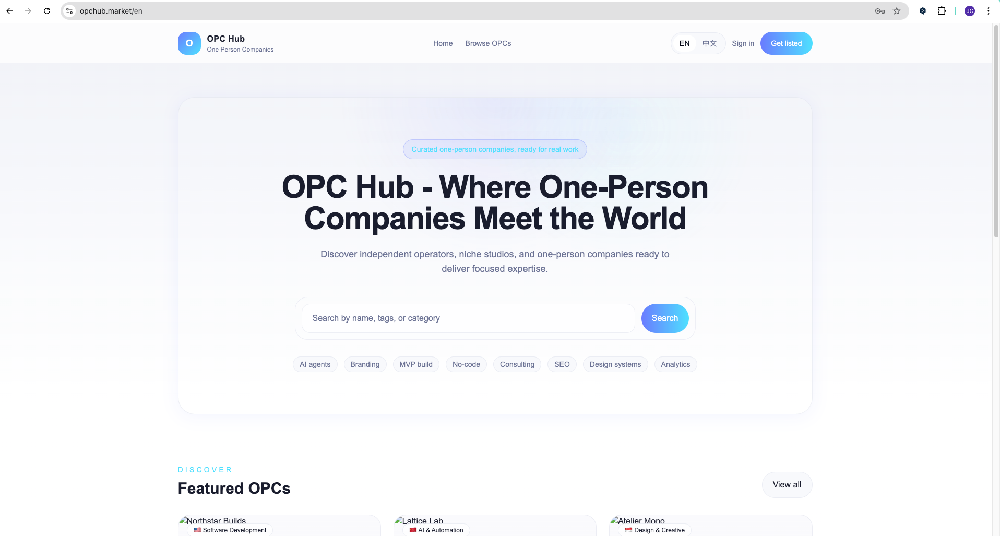

# 🌐 OPC Hub — Where One-Person Companies Meet the World

OPC Hub is a discovery platform for **one-person companies** — independent developers, freelance designers, solo consultants, and niche studios. Create a company profile, showcase your services, and get discovered by clients worldwide.

🔗 **[Visit OPC Hub → opchub.market](https://opchub.market)**

---

## 🏠 Preview

- **Company Profiles** — Create a detailed profile for your one-person company: services, skills, tags, and portfolio
- **Smart Discovery** — Browse and search OPCs by category, tag, language, and keyword
- **Direct Contact** — Reach out via email, phone, or WeChat — each contact channel can be toggled on/off
- **Portfolio Showcase** — Attach portfolio items with images to highlight your best work
- **Email Verification** — Secure signup with verification codes (powered by [Resend](https://resend.com))
- **JWT Authentication** — Stateless, secure auth powered by [jose](https://github.com/panva/jose)
- **i18n** — Full Chinese & English support
- **Dashboard** — Track profile views and contact clicks

## 🛠 Tech Stack

- **Next.js 14** (App Router, Standalone output)
- **TypeScript** + **Prisma** (SQLite)
- **Tailwind CSS** — Clean, modern white theme
- **next-intl** — Internationalization
- **Resend** — Transactional email
- **Zod** — Request validation

## 📬 Contact

Have questions or want to list your company? Visit [opchub.market](https://opchub.market) to get started.

## License

MIT © [BBJJCC](https://github.com/BBJJCC)
